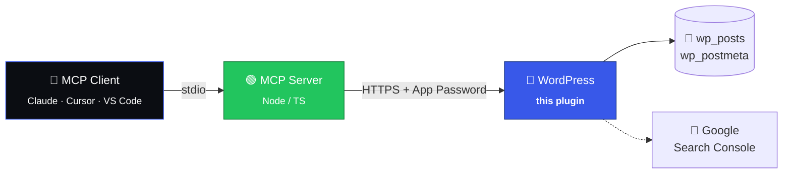

<div align="center">

<br>

<h1>
  <picture>
    <source media="(prefers-color-scheme: dark)" srcset="https://img.shields.io/badge/WP%20MCP%20Connect-Lite-3858E9?style=for-the-badge&labelColor=0b0d12">
    
  </picture>
</h1>

### Give your AI a WordPress backstage pass.

A headless WordPress plugin that opens **106 REST endpoints** for MCP clients<br>
to manage SEO, redirects, media, audits, analytics, and content — through plain conversation.

<br>

<p>
  <a href="https://github.com/dawsman/wp-mcp-connector-lite/releases"></a>
  
  
  
  
</p>

<sub>Pair with any MCP-compatible client — Claude Desktop, Cursor, VS Code — and talk to your site.</sub>

<br>

</div>

---

## ✨ What is this?

**WP MCP Connect Lite** is the WordPress half of an MCP integration. It runs quietly inside your site, exposing a dense REST surface that an MCP server can call to read content, edit metadata, audit health, sync Search Console, and far more.

> 🪶 **Lite?** This package is the **plugin only** — no React admin dashboard, no Node server bundled.<br>Bring your own MCP server (or use the companion repo) and point it at your site.

<br>

## 🧭 At a glance

<table>
<tr>
<td width="33%" valign="top">

### 🔍 SEO
Title tags, meta descriptions, Open Graph, JSON-LD schema. Bulk edit, focus keywords, cornerstone flags.

</td>
<td width="33%" valign="top">

### 🪄 Audits
Surface broken links, thin content, missing alt text, orphaned pages, decaying posts — with fixes you can apply.

</td>
<td width="33%" valign="top">

### ↪️ Redirects
Custom post type with import/export, enable/disable toggles, and 404-log promotion.

</td>
</tr>
<tr>
<td valign="top">

### 📊 Search Console
OAuth-connect GSC, sync queries, surface cannibalization, content gaps, and CTR-curve opportunities.

</td>
<td valign="top">

### 🗺️ Topology
Map internal-link graphs, cluster siblings, suggest links for orphaned posts, detect duplicates.

</td>
<td valign="top">

### 📬 Reports
Weekly SEO health digest with email delivery and a queryable audit log.

</td>
</tr>
</table>

<br>

## 🏗️ How it fits together



Your MCP client talks to a thin Node server. That server hits **`/wp-json/mcp/v1/*`** on your site, which this plugin registers and authenticates using a WordPress Application Password.

<br>

## 🚀 Quick start

<table>
<tr><td>

### 1️⃣ Install

```bash
# Drop the plugin into wp-content/plugins/
# Or upload the release zip via Plugins → Add New → Upload
```

### 2️⃣ Activate

```
WordPress Admin → Plugins → "WP MCP Connect Lite" → Activate
```

### 3️⃣ Generate an Application Password

```
Users → Profile → Application Passwords → "MCP" → Add New
```

### 4️⃣ Point your MCP server at the site

```env
WP_URL=https://your-site.com
WP_USERNAME=admin
WP_APP_PASSWORD=xxxx xxxx xxxx xxxx xxxx xxxx
```

</td></tr>
</table>

<br>

## 🧩 Endpoint surface

<details>
<summary><b>106 REST routes — click to expand a sampler</b></summary>

| Namespace | Examples |
|---|---|
| **Content** | `/content/broken-links` · `/content/thin` · `/content/orphaned` · `/content/decay` · `/content/clusters` · `/content/duplicates` |
| **SEO** | `/seo/bulk` · `/seo/meta-suggest` · `/seo/plugins` · focus keyword + cornerstone flags |
| **Redirects** | `redirects` CPT · `/redirects/io` (import/export) · 404 → redirect promotion |
| **Audits** | `/audit/summary` · `/audit-log` · `/tasks` queue · CSV export |
| **GSC** | `/gsc/auth/*` · `/gsc/insights` · `/gsc/cannibalization` · `/gsc/content-gaps` · `/gsc/ctr-curve` |
| **Analytics** | `/analytics/popular-posts` · topology · health-score |
| **Media** | `/content/broken-images` · alt-text bulk · media-extended |
| **Comments** | `/comments/pending` · `/comments/moderate` · `/comments/bulk-moderate` |
| **Ops** | `/batch` (multi-call) · `/api-access` · webhooks · settings |

All routes live under **`/wp-json/mcp/v1/`** and require an authenticated user with `manage_options`.

</details>

<br>

## 🔐 Authentication

Auth is handled exclusively through **WordPress Application Passwords** — no custom token store, no OAuth detour, no plaintext credentials in transit. Revoke in one click from the user profile screen.

```http
GET /wp-json/mcp/v1/audit/summary HTTP/1.1
Host: your-site.com
Authorization: Basic <base64(username:app_password)>
```

<br>

## 🧪 Local development

```bash
composer install
vendor/bin/phpunit              # run the test suite
vendor/bin/phpcs                # lint to WordPress coding standards
vendor/bin/phpcbf               # auto-fix style issues
./build.sh                      # produce a distributable zip
```

Requires **PHP 7.4+** and **WordPress 5.0+**. Tested up to **WordPress 6.7**.

<br>

## 🗣️ What you can ask your MCP client

Once connected, the client speaks WordPress on your behalf:

> *"Find every post missing a meta description and draft one for each."*<br>
> *"Show pages that lost the most clicks in GSC last month."*<br>
> *"Create a redirect from `/old-offer` to `/new-offer` and resolve the 404."*<br>
> *"List orphaned posts and suggest internal links from cluster siblings."*<br>
> *"Add FAQ schema to the pricing page."*<br>
> *"Email me the weekly SEO health report."*

<br>

## 📦 Releases & updates

Releases ship as zips under [GitHub Releases](https://github.com/dawsman/wp-mcp-connector-lite/releases). The plugin self-checks `update-info.json` so updates appear in the WordPress admin like any other plugin.

<br>

## 📝 License

Released under the **GPL-2.0+** license. Use it, fork it, ship it.

<br>

<div align="center">

<sub>Built by <a href="https://ftw.digital"><b>ftw.digital</b></a> — give your AI a WordPress backstage pass.</sub>

<br><br>

<a href="https://github.com/dawsman/wp-mcp-connector-lite/issues">🐛 Report a bug</a> ·
<a href="https://github.com/dawsman/wp-mcp-connector-lite/releases">📦 Download</a> ·
<a href="https://ftw.digital">🌐 ftw.digital</a>

</div>
